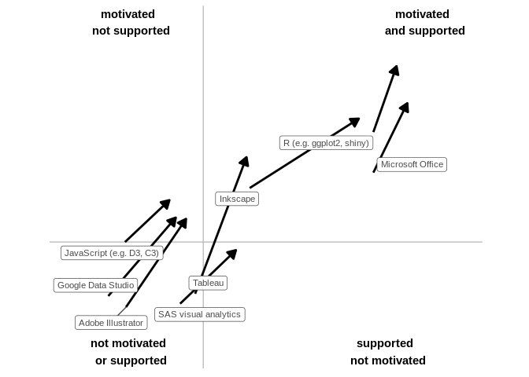

Data visualisation showcase
================

In September 2019 Kirsty Naylor and Joseph Adams ran an event where
people went round different tables to talk about the different software
tools they use in their jobs to present statistics. The [slides from the
event](https://drive.google.com/file/d/1gEqtWETn7ZEPYzhj4QnA11aC4cuDAxL2/view?usp=sharing)
have links to the examples discussed and list resources and networks for
presenting statistics.

## Summary

Attendees were mostly from SG and NRS and were fairly technical.

### Barriers

These are the barriers people most often listed to improving the
presentation and dissemination of their statistics:

  - Time to learn new tools
  - Access to software and cost of licences
  - Lack of a support network
  - Not knowing what users need
  - Not knowing what tool to use

### Enablers

These are the ways people most often listed to remove these barriers:

  - Training
  - Guidance on what tools are available (incl. pros, cons, and
    recommended use cases)
  - Sharing code more openly
  - More networking and sharing of internal knowledge

## Awareness

Almost everyone was already aware of Microsoft Office, R, and
Inkscape:

## Support and motivation

For all the tools discussed, most people left the event feeling more
motivated and supported to use them. There were 3 tools people felt
motivated and supported to use before the event:

  - R
  - Microsoft Office
  - Inkscape

After the event people also felt motivated and supported to use
Tableau.

### How this chart was made

Responses were mapped to numbers and then aggregated with a mean
average:

  - Strongly agree = 2
  - Agree = 1
  - Neither agree nor disagree = 0
  - Disagree = -1
  - Strongly disagree = -2

## ‘Speed-dating’ format

Feedback on the event format was positive:

> Really enjoyed event, an excellent way to showcase lots of different
> tools and their outputs and good opportunity to ask questions.

> As a member of staff new to SG, this was an excellent introduction
> into what software exists and what can be done with it.

> Loved it.

Although some things could be improved if we do it again. Particularly:

  - Have a break between sessions (7 in a row was too much)
  - Ensure internet access for everyone
  - Give presenters a chance to hear from other presenters
